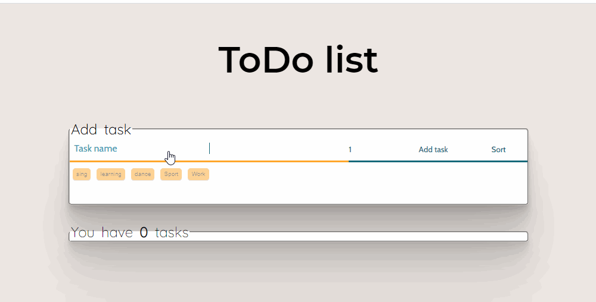

# Pre Course Project - Todo List 📋

I was inspired and helped by many sources, But there is no specific source for some thing. 

The inspired of buttons I take from here [buttons](https://codepen.io/hexagoncircle/pen/wvBmvOG)

## add tasks

> add task, and can add tags, all data including tags save on JSON.bin

## sort delete and Mark/Unmark todo as done

## Suitable for different screens

##  flexibility code
>  for example it is possible to add an addtional tags by adding only one line of html code, and the tag added on all the system, including the JSON.bin

## add task by `ctrl + enter`

